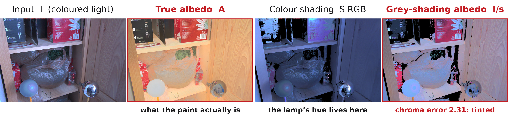

<div align="center">

# Coloured Illumination Constancy in Intrinsic Image Decomposition<br>via Cross-Render Albedo Invariance

**Minh Khang Tran**

Erasmus Mundus Joint Master in Computational Colour and Spectral Imaging (COSI)<br>
Norwegian University of Science and Technology (NTNU), Gjøvik

[](documents/thesis/Main.pdf)
[](https://www.python.org)
[](https://pytorch.org)



</div>

<p align="center"><em>A grayscale shading model cannot absorb an illuminant's hue: with only a scalar shading <code>s</code>,<br>
the lamp's colour has nowhere to go but the albedo. Both albedos come from the same frame and the<br>
same ground truth, and differ only in the shading model they were divided by.</em></p>

---

## Overview

Most intrinsic image decomposition (IID) methods assume white light. Real interiors do not oblige:
warm lamps and cool daylight tint the recovered **albedo**, so the same wall appears to change
colour when the lighting does.

We introduce **Cross-Render Albedo Invariance (CARI)**, a training strategy built on one
constraint — *if the same surface appears in two photographs lit differently, its albedo must be
identical in both*. Two losses enforce it on pixel-aligned pairs:

- **`L_inv`** penalises any change in predicted albedo across the two illuminants;
- **`L_expl`** requires the *shading* ratio to match the *image* ratio, so any colour the albedo
  declines to absorb must be explained by the shading.

A practical prerequisite: standard white-balance preprocessing removes exactly the illuminant
colour CARI needs, so we train on **raw, un-white-balanced pairs**.

### The metric problem

Evaluating this claim required correcting how it is measured. The chroma-cast score used
throughout this literature pools albedo chromaticity **across materials** before taking its
variance, conflating illuminant-induced drift with the scene's ordinary chromatic diversity.
Because that second term is computed from the *prediction*, **a model can improve its score simply
by washing the colour out of its albedo** — the metric pays models to destroy the very quantity
the task exists to recover.

We decompose it into a scale-normalised invariance term (`Cast_rel`) and a fidelity term anchored
on measured albedo (`Chroma_fid`), and show the correction **reverses the ranking of our own
ablation**.

---

## Results

Four benchmarks spanning real and synthetic scenes. Every row is evaluated locally under one
harness; see the thesis for protocols, bootstrap confidence intervals and the full ablations.

### MID — cross-illumination constancy and chroma calibration

`Chroma_fid → 1` is the collapse detector: **below 1 means albedo colour has been discarded.**

| Method | `C_mat` ↓ | `Chroma_err` ↓ | `Cast_rel` ↓ | `Chroma_fid` (→1) |
|:---|:---:|:---:|:---:|:---:|
| **Ours (full model)** | **0.130** | **0.121** | 0.421 | 0.941 |
| **Ours (base CARI)** | 0.157 | 0.129 | 0.425 | **0.999** |
| Marigold-App | 0.193 | 0.195 | **0.355** | 0.728 |
| Marigold-Light | 0.546 | 0.154 | 0.392 | 1.148 |
| CRefNet | 0.151 | 0.201 | **0.355** | 0.484 |
| Ordinal Shading | 0.252 | 0.148 | 0.549 | 0.924 |

We do **not** claim the invariance crown — Marigold-App and CRefNet lead `Cast_rel`. The table shows
how they buy it: by discarding roughly a quarter and half of real albedo chroma respectively. Ours
is the only method that is simultaneously colour-faithful **and** competitively invariant.

### ARAP · MAW · IIW

| Method | ARAP `C_arap` ↓<br><sub>indoor, colour-varying</sub> | MAW ΔE ↓ | IIW WHDR ↓ |
|:---|:---:|:---:|:---:|
| **Ours (full model)** | **0.096** | 3.981 | 0.264 |
| Ours (base CARI) | 0.119 | 4.155 | 0.286 |
| Ours (IIW-fine-tuned) | — | 5.163 | *0.220* |
| Marigold-App | 0.113 | **3.775** | 0.193 |
| CRefNet | 0.129 | 3.970 | **0.168** |
| Ordinal Shading | 0.165 | 6.884 | 0.257 |

The remaining gap is perceptual shading quality (IIW). Fine-tuning on IIW improves WHDR to 0.220 but
**degrades every constancy measure** — a direct demonstration of the constancy–structure tension.

### Efficiency

| Method | Trainable (M) | Total (M) | s / image |
|:---|:---:|:---:|:---:|
| **Ours** | **18.5** | 322.9 | **0.148** |
| Marigold-App | ~1290 | 1290 | 0.805 |
| Marigold-Light | ~1290 | 1290 | 0.982 |
| CRefNet | 66.6 | 66.6 | 0.447 |
| Ordinal Shading | ~337 | ~337 | — |

Roughly **70× fewer trained weights** than the diffusion baselines and **~5× faster**, in a single
forward pass.

---

## Method

```
                    ┌───────────────────────┐
   I ──────────────►│ DINOv2-L/14 (frozen)  │──► multi-scale tokens
                    └───────────┬───────────┘
                                ▼
                    ┌───────────────────────┐
                    │ DPT trunk 768→…→64    │
                    └────┬─────────────┬────┘
                RGB skip │             │ luminance skip
                         ▼             ▼
                    albedo A_d      shading π ──► S_d = (1−π)/π
                         └──────┬──────┘
                                ▼
                   R = (I − A_d ⊙ S_d)₊     (analytic residual)
```

Only the DPT trunk and heads are trained (18.5 M parameters); the encoder stays frozen. The skips
are physics-typed: full RGB reaches the albedo head, luminance only reaches the shading head.
**CARI is a loss, not an architecture** — it applies to cross-illuminant pairs during training and
costs nothing at inference.

---

## Installation

```bash
git clone https://github.com/tmkhang1999/CARI.git
cd CARI

conda create -n cari python=3.10 -y
conda activate cari
pip install -r requirements.txt
```

Tested with PyTorch 2.10 + CUDA 12.8 on Linux. Training wants a GPU with ≥ 12 GB; inference runs
comfortably in 6 GB.

---

## Data preparation

| Corpus | Role | Source |
|:---|:---|:---|
| **Hypersim** | Primary supervised albedo + shading | [apple/ml-hypersim](https://github.com/apple/ml-hypersim) |
| **MID** | Real cross-render pairs — the CARI signal | [Multi-Illumination Dataset](https://projects.csail.mit.edu/illumination/) |
| **InteriorVerse** | Albedo-supervision diversity | [InteriorVerse](https://interiorverse.github.io/) |
| **3D-Front-IID** | Rendered here: large *coloured* illuminant changes + GT albedo | built from [3D-FRONT](https://tianchi.aliyun.com/dataset/65347) |

Expected layout (roots are configurable per-config):

```
datasets/
├── hypersim/
├── MIDIntrinsics/
│   ├── train/
│   └── test/            # 30 held-out scenes
├── InteriorVerse/
└── 3D-Front-IID/
```

<details>
<summary><b>Rendering the 3D-Front-IID corpus</b></summary>

3D-Front-IID supplies the one combination no public corpus offers: a large, deliberately coloured
illuminant change **and** ground-truth albedo for the same camera. Key lights are sampled *off* the
blackbody locus, and a minimum chromatic separation is enforced so every pair carries a real
illuminant-colour change (median separation 0.23 in rg-chromaticity).

```bash
python scripts/render_3dfront_dataset.py --out datasets/3D-Front-IID
```

Requires Blender (tested with 4.2.0).
</details>

---

## Training

```bash
# Full model (V17 + CARI)
bash scripts/train.sh --version 17 --cuda 0

# Resume from the latest checkpoint
bash scripts/train.sh --version 17 --cuda 0 --auto-resume
```

Configuration lives in `src/configs/`: `base.yaml` holds shared defaults, and each `v17_*.yaml`
overrides it for a single experiment.

<details>
<summary><b>Which config maps to which reported table</b></summary>

| Config | Role in the thesis |
|:---|:---|
| `v17_41` … `v17_44` | Table A — CARI × colour-path ablation (`v17_44` = **base CARI**) |
| `v17_20`, `v17_23`, `v17_29`, `v17_33`, `v17_34` | Table B — refinement study (`v17_34` = **full model**) |
| `v17_26` | IIW fine-tuning study |

The two levers toggled in Table B are `flat` (texture-gated flatness prior) and `sh_inv`
(inverse-domain shading supervision).
</details>

---

## Evaluation

Each benchmark has a standalone evaluator under `tests/eval/`; all accept `--device` and write JSON.

```bash
CKPT=checkpoints/v17_34/checkpoint_latest.pth

# MID — constancy + chroma calibration
python tests/eval/eval_mid_constancy.py --ckpts $CKPT \
    --mid-root datasets/MIDIntrinsics --split test --save-json

# ARAP — constancy (raw input) and accuracy (white-balanced input)
python tests/eval/eval_arap.py --checkpoint $CKPT --constancy
python tests/eval/eval_arap.py --checkpoint $CKPT

# MAW — measured-albedo colour accuracy
python tests/eval/eval_maw.py --ckpts $CKPT --save-json

# IIW — WHDR
python tests/eval/eval_iiw.py --checkpoint $CKPT
```

> [!IMPORTANT]
> ARAP **constancy** must run on the raw coloured renderings — white-balancing would erase the very
> variable being probed. ARAP **accuracy** uses input white-balanced by reconstructing an
> achromatic-illuminant image from the ground-truth albedo. The two are not interchangeable.

External baselines run through thin adapters in
`tests/eval/{marigold,crefnet,ordinal}_adapter.py`, so every method is evaluated at the same
resolution under one harness.

---

## Repository layout

```
src/
├── models/
│   ├── v17.py                  # the reported architecture
│   ├── encoders/dino_encoder.py
│   ├── decoders/dpt_decoder.py
│   └── iid_utils.py            # inverse-domain shading, derive / uninvert
├── losses/flexible_loss_v17.py # all loss terms, including CARI
├── data/                       # Hypersim, MID, InteriorVerse, 3D-Front, IIW
├── configs/                    # base.yaml + v17_*.yaml
└── train_v17.py
tests/
├── eval/                       # four benchmark evaluators + SOTA adapters
└── viz/                        # figure builders
documents/thesis/               # LaTeX sources for the thesis
```

Every figure in the thesis is traceable to the script that produced it, via
[`documents/thesis/FIGURE_PROVENANCE.md`](documents/thesis/FIGURE_PROVENANCE.md).

---

## Citation

```bibtex
@mastersthesis{tran2026cari,
  title  = {Coloured Illumination Constancy in Intrinsic Image Decomposition
            via Cross-Render Albedo Invariance},
  author = {Tran, Minh Khang},
  school = {Norwegian University of Science and Technology (NTNU)},
  note   = {Erasmus Mundus Joint Master in Computational Colour
            and Spectral Imaging (COSI)},
  year   = {2026}
}
```

---

## Acknowledgements

Supervised by Dr. Luis Gomez Robledo and Prof. Seyed Ali Amirshahi (COSI), with Dr. Sezer Karaoglu
and Prof. Theo Gevers at the host institution.

This work builds on [DINOv2](https://github.com/facebookresearch/dinov2) and
[DPT](https://github.com/isl-org/DPT) for the backbone, and is evaluated against
[Marigold-IID](https://github.com/prs-eth/Marigold),
[Ordinal Shading](https://github.com/compphoto/Intrinsic) and CRefNet (Luo et al., TVCG 2024).
Benchmarks come from [IIW](http://opensurfaces.cs.cornell.edu/intrinsic/),
[MID](https://projects.csail.mit.edu/illumination/), [MAW](https://measuredalbedo.github.io/) and
ARAP (Bonneel et al., CGF 2017). Training data comes from
[Hypersim](https://github.com/apple/ml-hypersim), [InteriorVerse](https://interiorverse.github.io/)
and [3D-FRONT](https://tianchi.aliyun.com/dataset/65347). We thank the authors of all of the above
for releasing their code and data.
