<div align="center">

# Coloured Illumination Constancy in Intrinsic Image Decomposition<br>via Cross-Render Albedo Invariance

**Minh Khang Tran**

Erasmus Mundus Joint Master in Computational Colour and Spectral Imaging (COSI)<br>
Norwegian University of Science and Technology (NTNU), Gjøvik

[](documents/thesis/Main.pdf)
[](https://tmkhang1999.github.io/research/cari/)
[](https://www.python.org)
[](https://pytorch.org)

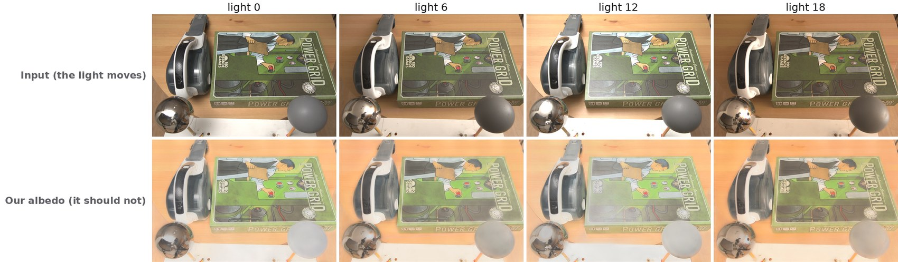

</div>

<p align="center"><em>The light moves; the material does not. One scene under four lamp settings (top),<br>
and the material colour our model recovers from each photograph independently (bottom).<br>
Nothing about the surface changed between the four shots, so nothing about the albedo should either.</em></p>

---

> **TL;DR**
> - Indoor lights are coloured, so recovered **albedo** gets tinted and a wall seems to change colour with the lighting.
> - **CARI** fixes this in training: the same surface, photographed under two illuminants, must yield the *same* albedo. Inference stays one image, one forward pass.
> - The standard chroma-cast metric is **gameable** — a model scores better by desaturating. We decompose it, and the fix flips our own ablation's ranking.
> - Under the repaired metrics we lead **lightness stability** while training 24× fewer parameters than the strongest baseline (CD-IID), and we do **not** lead the colour axes.

---

## Contributions

**1 · A training signal that comes from photographs, not priors.**
Constancy is usually pursued by adding a regulariser and hoping it generalises. CARI instead
supplies the missing *evidence* — pairs of real photographs of one scene under different lamps,
with the albedo required to agree across the pair. The pairing is a training-time constraint only:
deployment is one image, one forward pass, **18.5 M** trainable parameters, **0.148 s** at 512×512.

**2 · A demonstration that the field's constancy metric is gameable, and a fix.**
The standard chroma-cast score pools chromaticity across materials before taking its variance, so a
model scores better by desaturating — a fully grey albedo is perfectly invariant. We split it into a
scale-normalised invariance term (`Cast_rel`) and a fidelity term anchored on reference chroma
(`Chroma_fid`). The correction is not self-serving: applying it **reversed the ranking of our own
ablation**, and it is why this README reports two baselines beating us on invariance.

**3 · An evaluation that scores both axes at once.**
Judged on stability alone the most desaturated model wins; judged on accuracy alone, cross-light
drift is invisible. Running eight methods through one harness turns up three distinct failure modes
— *stable-but-colourless* (CRefNet), *colourful-but-miscalibrated* (RGB→X), and *good-at-both*
(CD-IID) — which a single fidelity score would collapse into one number. That is the measurement
that the split was necessary, not merely reasonable.

---

## 1 · A single grey number has nowhere to put a colour

Write a photograph as material times shading, `I = A ⊙ S_d + R`. If shading is one channel per
pixel, it can only make a surface lighter or darker — it cannot be orange. So when a tungsten lamp
throws warm light across a white wall, that hue has exactly one place left to go: into the albedo,
the one layer that is supposed to describe the paint rather than the lamp.

<div align="center">
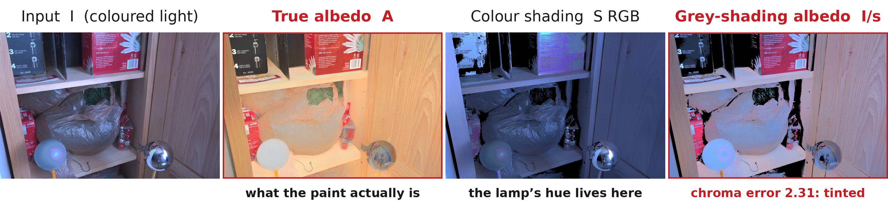
</div>

<p align="center"><em>Two explanations of one image. Both reconstruct the input exactly — they differ only in<br>
the shading model they were divided by. With scalar shading, the lamp's hue is pushed into the material.</em></p>

Giving the model RGB shading is necessary but not sufficient. Methods that already have
three-channel shading still drift when the illuminant changes, and they drift in different ways:
some hold still by quietly desaturating everything, others keep colour but land on the wrong one.

## 2 · One photograph cannot tell you what the light did

From a single image, a warm surface under white light and a white surface under warm light are the
same picture. No loss on one photograph can separate them, because the evidence is not in the frame.
A **second photograph of the same scene under a different lamp** is: whatever changed between the two
shots is lighting, and whatever did not is material.

<div align="center">
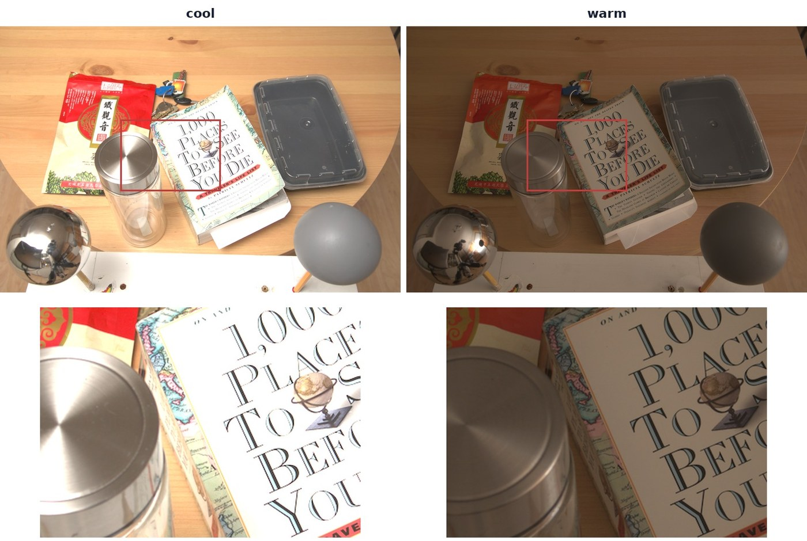
</div>

<p align="center"><em>Same camera, same objects, same materials — only the lamps changed.<br>
MID supplies thousands of such pixel-aligned pairs of real indoor scenes.</em></p>

> [!IMPORTANT]
> Standard preprocessing works against this. White balance removes exactly the illuminant colour CARI
> needs to observe, so the paired images are kept **raw and un-white-balanced**, while the synthetic
> supervision that anchors absolute colour stays white-balanced.

## 3 · Method

**CARI is a loss, not an architecture.** It applies to pixel-aligned cross-illuminant pairs during
training and costs *nothing* at inference.

| Loss | Says | Why it is needed |
|:---|:---|:---|
| `L_inv` | the albedo must not move between the pair | the constancy constraint itself |
| `L_expl` | the *shading* ratio must match the *image* ratio | otherwise a lazy model satisfies `L_inv` by ignoring lighting |
| `L_chroma` | the albedo hue must match ground truth, up to brightness | two predictions can agree perfectly and both be wrong |

<div align="center">
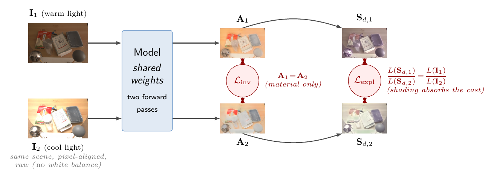
<p><em>Two inputs, visibly different casts, one shared-weight model — and near-identical albedos.</em></p>
</div>

Only the DPT trunk and the two heads are trained (**18.5 M** parameters); the DINOv2-L/14 encoder
stays frozen. DINOv2's illumination-invariant tokens discard exactly the colour the albedo head
needs, so a gamma-encoded **RGB skip** feeds full-resolution colour straight into it — safe only
*because* CARI's invariance loss stops the illuminant hue from riding along with it. The residual
`R = (I − A ⊙ S_d)₊` is analytic; it has no head of its own.

<div align="center">
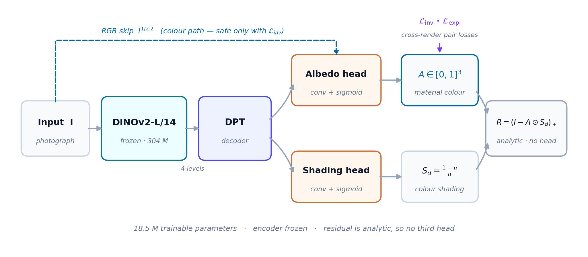
</div>

## 4 · The constancy metric pays models to destroy colour

Evaluating the claim required repairing how it is measured. The chroma-cast score used throughout
this literature pools albedo chromaticity **across materials** before taking its variance, conflating
illuminant-induced drift with the scene's ordinary chromatic diversity. Because that second term is
computed from the *prediction*:

> **A model can improve its score simply by washing the colour out of its albedo.**
> A perfectly grey prediction is perfectly invariant. The metric pays models to destroy the very
> quantity the task exists to recover.

<div align="center">
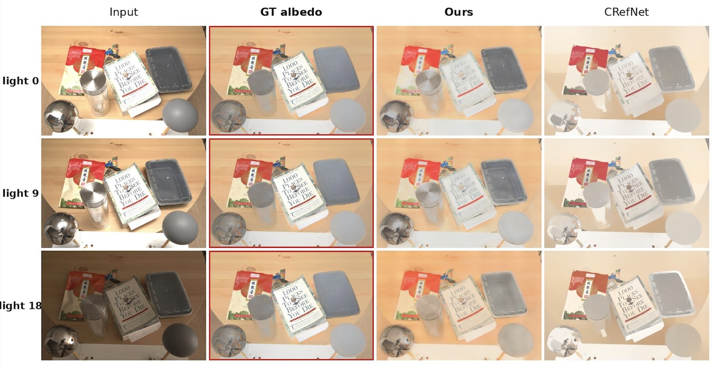
</div>

So we score two questions separately, and require a method to answer both:

| | Metric | Asks |
|:---|:---|:---|
| **Stability** | `C_mat` ↓ | does a material's recovered *brightness* stay put across lamps? |
| **Stability** | `Cast_rel` ↓ | does its *chroma* stay put, normalised per material so scene diversity cannot inflate it? |
| **Fidelity** | `Chroma_err` ↓ | is that stable colour the *correct* one? |
| **Fidelity** | `Chroma_fid` → 1 | how much of the reference chroma spread survives? **Below 1 means colour was discarded.** |

<div align="center">
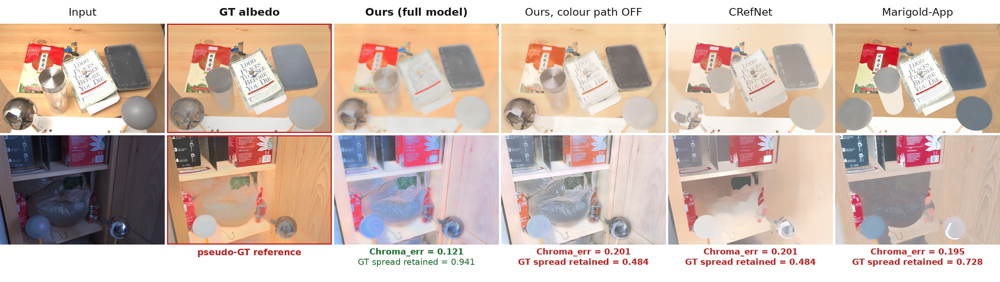
<p><em>Invariance bought by discarding colour is visible to the naked eye. <code>Chroma_fid</code> makes it measurable.</em></p>
</div>

---

## 5 · Results

Four benchmarks spanning real and synthetic scenes. Every row is evaluated locally under one
harness; see the thesis for protocols, bootstrap confidence intervals and full ablations.

### MID — stability and fidelity, scored together

Brackets are 95% percentile-bootstrap intervals over scenes, showing scene-to-scene spread;
`Chroma_fid` carries none in the thesis table, so none is added here. These are *marginal*
intervals — the comparisons are **paired** (every method scored on the same scenes), and
significance comes from a paired bootstrap, not from whether these brackets overlap.

| Method | `C_mat` ↓ | `Chroma_err` ↓ | `Cast_rel` ↓ | `Chroma_fid` (→1) |
|:---|:---:|:---:|:---:|:---:|
| **Ours (full model)** | 0.130 `[.117,.144]` | 0.121 `[.102,.143]` | 0.421 `[.357,.485]` | 0.941 |
| **Ours (base CARI)** | 0.157 `[.141,.174]` | 0.129 `[.109,.150]` | 0.425 `[.360,.491]` | **0.999** |
| CD-IID | 0.190 `[.172,.210]` | **0.090** `[.073,.110]` | **0.306** `[.262,.355]` | 0.944 |
| RGB→X | **0.128** `[.115,.141]` | 0.203 `[.170,.239]` | 0.338 `[.273,.409]` | 0.907 |
| Marigold-App | 0.193 `[.173,.214]` | 0.195 `[.152,.245]` | 0.355 `[.309,.406]` | 0.728 |
| Marigold-Light | 0.546 `[.462,.645]` | 0.154 `[.124,.187]` | 0.392 `[.333,.459]` | 1.148 |
| CRefNet | 0.151 `[.138,.164]` | 0.201 `[.165,.241]` | 0.355 `[.309,.406]` | 0.484 |
| Ordinal Shading | 0.252 `[.229,.279]` | 0.148 `[.130,.166]` | 0.549 `[.463,.637]` | 0.924 |

<div align="center">
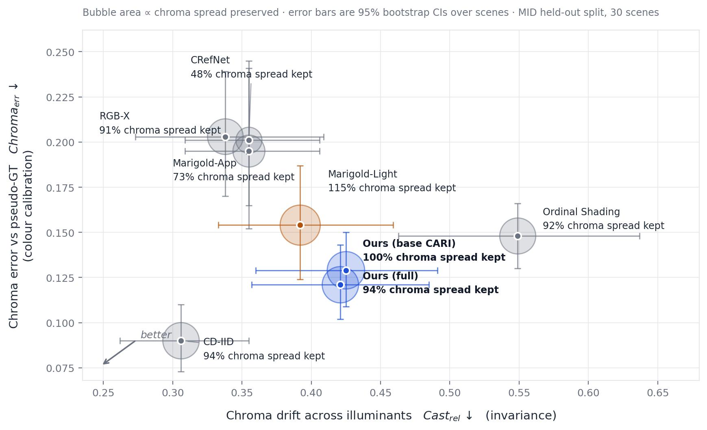
</div>

<div align="center">
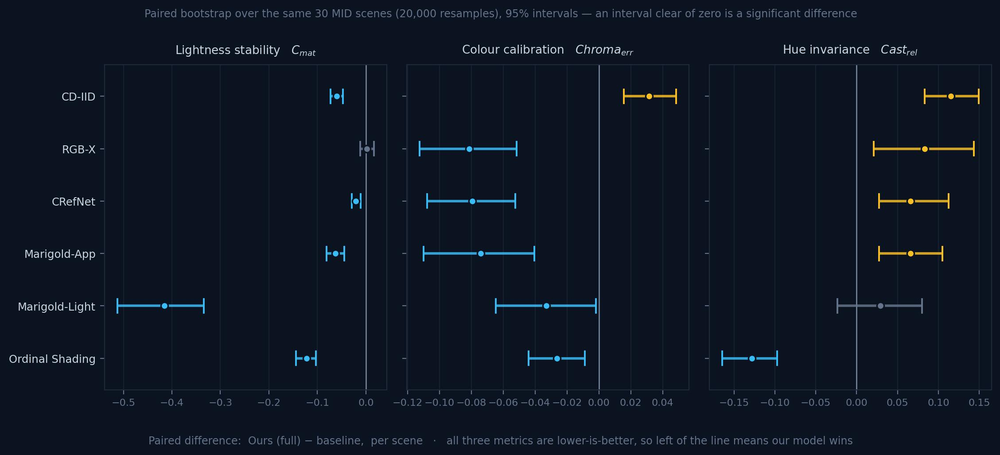
</div>

<p align="center"><em>The same comparison, tested properly. Every method is scored on the same 30 scenes,<br>
so the difference is taken scene by scene — which cancels scene difficulty and resolves what the<br>
marginal intervals leave ambiguous. Left of the line means our model wins.</em></p>

**We lead one axis, and we state only that.** On **lightness stability** our model is best in
the table (`C_mat` 0.130), significantly better than every baseline except RGB→X, from which it
is not separable. We do **not** lead the colour columns: CD-IID reaches both a lower `Chroma_err`
(0.090 vs 0.121) and a lower `Cast_rel` (0.306 vs 0.421), both significant under the paired test.

Note what CD-IID does *not* do: its `Chroma_fid` is 0.944, statistically indistinguishable from
our 0.941. It is not buying invariance by draining colour, so the collapse argument that explains
CRefNet (0.484) and Marigold-App (0.728) does not explain it. Invariance won by desaturation is a
real failure mode, but not the only route to invariance.

**Three failure modes, and why one fidelity number cannot see them.** CRefNet is *stable but
colourless* — low drift, `Chroma_fid` 0.484 because the colour is gone. RGB→X is *colourful but
miscalibrated* — it keeps the spread (0.907) but puts it on the wrong hues, giving the worst
`Chroma_err` in the table (0.203). CD-IID is good at both. A pooled score would rank CRefNet well
and miss RGB→X's error; `Chroma_fid` alone would clear RGB→X and condemn CRefNet. Only the pair
separates all three — the measurement that the split was necessary, not merely reasonable.

**What makes the surviving claim worth stating is its price.** That lightness result comes from
training **18.5 M** parameters against CD-IID's **442.8 M** — every stage optimised — at
**0.148 s** per image against 0.254 s. A large part of cross-illuminant stability is reachable by
changing the training *evidence* rather than by scaling the decoder.

### Does CARI cause the gain?

A 2×2 ablation switches the paired CARI losses and the colour-detail path on and off independently,
keeping everything else matched. Only the horizontal comparisons (Row 1→2 and Row 3→4) isolate CARI.

<div align="center">
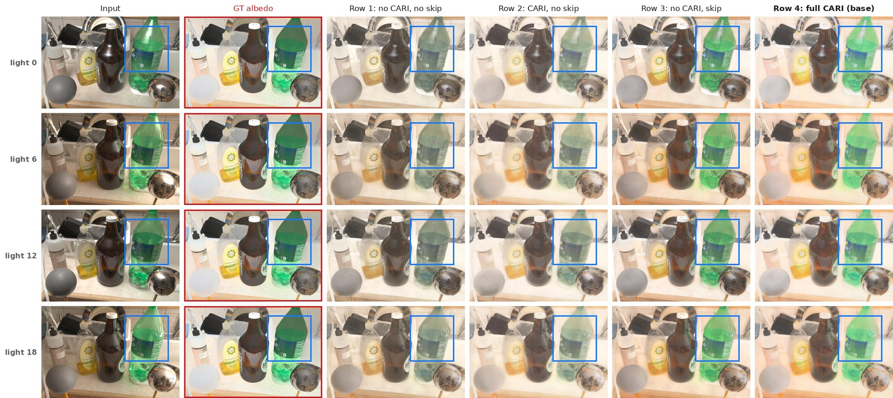
</div>

<p align="center"><em>The boxed object group is identical in every panel. CARI steadies the recovered colour<br>
across rows; the colour path restores material detail.</em></p>

The paired losses also improve conventional accuracy on raw input, in both matched settings: ARAP
LMSE and mn-RMSE both fall by **14 %** from Row 1→2, and by **7–8 %** from Row 3→4.

### ARAP · MAW · IIW

Accuracy, on the three external benchmarks. All rows run locally through one harness.

| Method | MAW ΔE ↓<br><sub>measured colour</sub> | ARAP mn-RMSE ↓<br><sub>dense albedo</sub> | IIW WHDR ↓<br><sub>relative reflectance</sub> |
|:---|:---:|:---:|:---:|
| **Ours (full model)** | 3.981 | **0.2150** | 0.264 |
| Ours (base CARI) | 4.155 | 0.2259 | 0.286 |
| CRefNet | 3.970 | 0.2916 | **0.168**<sup>†</sup> |
| Marigold-App | **3.775** | 0.2529 | 0.193 |
| Marigold-Light | 4.214 | 0.6187 | 0.215 |
| Ordinal Shading | 6.884 | — | 0.257 |

We lead dense albedo accuracy and sit within 0.2 ΔE of the best measured-colour score, so constancy
is not being bought with accuracy. We do **not** lead IIW — and <sup>†</sup>CRefNet trains on the IIW
training split, so its WHDR is not zero-shot and is not comparable to ours. WHDR also reduces albedo
to a lightness ordering before scoring, making it blind to colour by construction: it cannot validate
or refute the constancy claim either way. Ordinal Shading has no local ARAP row; the thesis reports
its published figure separately rather than mixing protocols.

On the constancy axis these same external scenes give ARAP `C_arap` = **0.096** for our full model
(indoor, colour-varying), against 0.113 for Marigold-App, 0.129 for CRefNet and 0.165 for Ordinal.
Fine-tuning on IIW improves WHDR to *0.220* but **degrades every constancy measure** — a direct
demonstration of the constancy–structure tension.

<div align="center">
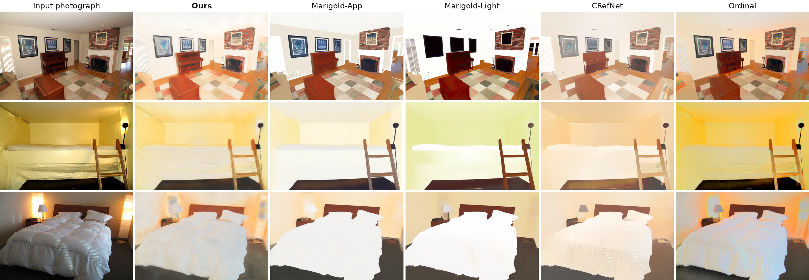
<p><em>Qualitative comparison. Predictions are scale-normalised for display, with no colour correction.</em></p>
</div>

### Efficiency

| Method | Trainable (M) | Total (M) | s / image |
|:---|:---:|:---:|:---:|
| **Ours** | **18.5** | 322.9 | **0.148** |
| Marigold-App | ~1290 | 1290 | 0.805 |
| Marigold-Light | ~1290 | 1290 | 0.982 |
| CRefNet | 66.6 | 66.6 | 0.447 |
| Ordinal Shading | ~337 | ~337 | — |

Roughly **70× fewer trained weights** than the diffusion baselines and **~5× faster**, in a single
forward pass. On *total* parameters we are not the small model — CRefNet is 4.8× smaller.

---

## 6 · What is still broken

CARI reduces coloured-light leakage. It does not resolve the decomposition ambiguity, and the
failures are systematic rather than incidental.

<div align="center">
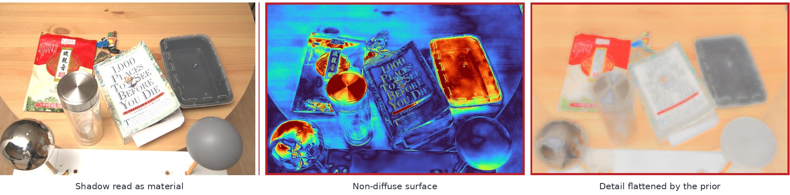
</div>

| Failure | Why it happens | Direction it points at |
|:---|:---|:---|
| Hard shadows read as material | a sharp shadow boundary survives into the albedo as if it were a paint edge | harder real cross-light pairs, not a different loss |
| Non-diffuse surfaces stay unstable | the diffuse model is simply violated on gloss and metal | spatially varying / non-diffuse illumination modelling |
| The flatness prior over-smooths | it improves benchmark scores while suppressing genuine fine detail | content-aware flatness weighting |

---

## Quick start

```bash
git clone https://github.com/tmkhang1999/CARI.git
cd CARI
conda create -n cari python=3.10 -y && conda activate cari
pip install -r requirements.txt
```

Decompose any photograph into albedo, shading and residual:

```bash
python tests/infer/infer_wild.py \
    --image path/to/your_photo.jpg \
    --checkpoint checkpoints/v17_34/checkpoint_latest.pth \
    --device cuda --max_size 1280
```

<div align="center">
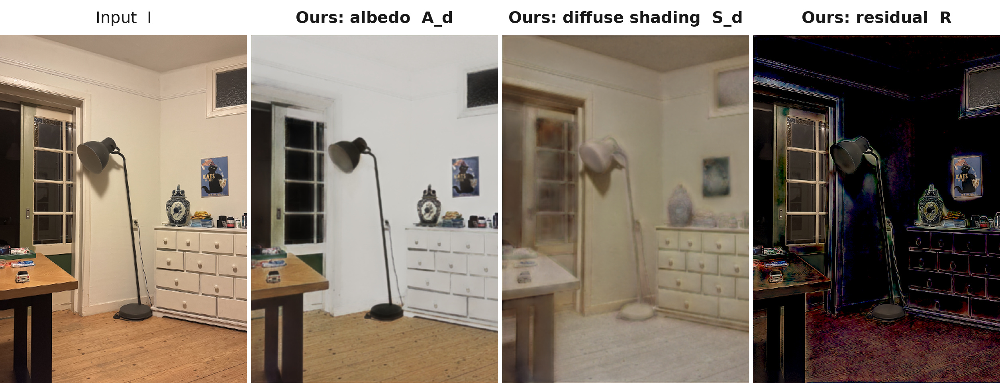
<p><em>Input · diffuse albedo <code>A_d</code> · diffuse shading <code>S_d</code> · analytic residual <code>R</code>.<br>
Albedo and shading are independently normalised for display; the residual is shown unamplified.</em></p>
</div>

Tested with PyTorch 2.10 + CUDA 12.8 on Linux. Training wants a GPU with ≥ 12 GB; inference runs
comfortably in 6 GB.

> [!NOTE]
> Pretrained weights are not distributed in this repository (each raw checkpoint is ~1.4 GB, of
> which ~94 % is the frozen DINOv2 encoder). Please open an issue if you would like access.

---

## Data preparation

| Corpus | Role | Source |
|:---|:---|:---|
| **Hypersim** | Primary supervised albedo + shading | [apple/ml-hypersim](https://github.com/apple/ml-hypersim) |
| **MID** | Real cross-render pairs — the CARI signal | [Multi-Illumination Dataset](https://projects.csail.mit.edu/illumination/) |
| **InteriorVerse** | Albedo-supervision diversity | [InteriorVerse](https://interiorverse.github.io/) |
| **3D-Front-IID** | Rendered here: large *coloured* illuminant changes + GT albedo | built from [3D-FRONT](https://tianchi.aliyun.com/dataset/65347) |

```
datasets/
├── hypersim/
├── MIDIntrinsics/
│   ├── train/
│   └── test/            # 30 held-out scenes
├── InteriorVerse/
└── 3D-Front-IID/
```

<details>
<summary><b>Rendering the 3D-Front-IID corpus</b></summary>

<br>

3D-Front-IID supplies the one combination no public corpus offers: a large, deliberately coloured
illuminant change **and** ground-truth albedo for the same camera. Key lights are sampled *off* the
blackbody locus, and a minimum chromatic separation is enforced so every pair carries a real
illuminant-colour change (median separation 0.23 in rg-chromaticity).

<div align="center">
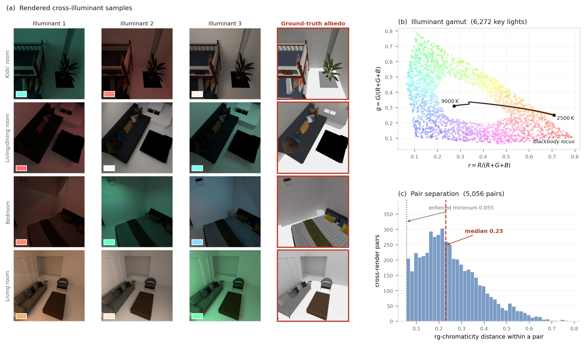
</div>

```bash
python scripts/render_3dfront_dataset.py --out datasets/3D-Front-IID
```

Requires Blender (tested with 4.2.0).
</details>

---

## Training

```bash
# Full model (V17 + CARI)
bash scripts/train.sh --version 17 --cuda 0

# Resume from the latest checkpoint
bash scripts/train.sh --version 17 --cuda 0 --auto-resume
```

`src/configs/base.yaml` holds shared defaults; each `v17_*.yaml` overrides it for one experiment.

<details>
<summary><b>Which config maps to which reported table</b></summary>

<br>

| Config | Role in the thesis |
|:---|:---|
| `v17_41` … `v17_44` | Table A — CARI × colour-path ablation (`v17_44` = **base CARI**) |
| `v17_20`, `v17_23`, `v17_29`, `v17_33`, `v17_34` | Table B — refinement study (`v17_34` = **full model**) |
| `v17_26` | IIW fine-tuning study |

The two levers toggled in Table B are `flat` (texture-gated flatness prior) and `sh_inv`
(inverse-domain shading supervision).
</details>

---

## Evaluation

Each benchmark has a standalone evaluator under `tests/eval/`.

```bash
CKPT=checkpoints/v17_34/checkpoint_latest.pth

# MID — constancy + chroma calibration
python tests/eval/eval_mid_constancy.py --ckpts $CKPT \
    --mid-root datasets/MIDIntrinsics --split test --save-json

# ARAP — constancy (raw input) and accuracy (white-balanced input)
python tests/eval/eval_arap.py --checkpoint $CKPT --constancy
python tests/eval/eval_arap.py --checkpoint $CKPT

# MAW — measured-albedo colour accuracy
python tests/eval/eval_maw.py --ckpts $CKPT --save-json

# IIW — WHDR
python tests/eval/eval_iiw.py --checkpoint $CKPT --dataset_dir tests/testing_data/iiw-dataset/data
```

> [!IMPORTANT]
> ARAP **constancy** must run on the raw coloured renderings — white-balancing would erase the very
> variable being probed. ARAP **accuracy** uses input white-balanced by reconstructing an
> achromatic-illuminant image from the ground-truth albedo. The two are not interchangeable.

External baselines run through thin adapters in
`tests/eval/{marigold,crefnet,ordinal}_adapter.py`, so every method is evaluated at the same
resolution under one harness.

---

## Repository layout

```
src/
├── models/
│   ├── v17.py                  # the reported architecture
│   ├── encoders/dino_encoder.py
│   ├── decoders/dpt_decoder.py
│   └── iid_utils.py            # inverse-domain shading, derive / uninvert
├── losses/flexible_loss_v17.py # all loss terms, including CARI
├── data/                       # Hypersim, MID, InteriorVerse, 3D-Front, IIW
├── configs/                    # base.yaml + v17_*.yaml
└── train_v17.py
tests/
├── eval/                       # four benchmark evaluators + SOTA adapters
├── infer/                      # single-image inference
└── viz/                        # figure builders
documents/thesis/               # LaTeX sources for the thesis
```

Every figure in the thesis is traceable to the script that produced it, via
[`FIGURE_PROVENANCE.md`](documents/thesis/FIGURE_PROVENANCE.md).

---

## Citation

```bibtex
@mastersthesis{tran2026cari,
  title  = {Coloured Illumination Constancy in Intrinsic Image Decomposition
            via Cross-Render Albedo Invariance},
  author = {Tran, Minh Khang},
  school = {Norwegian University of Science and Technology (NTNU)},
  note   = {Erasmus Mundus Joint Master in Computational Colour
            and Spectral Imaging (COSI)},
  year   = {2026}
}
```

---

## Acknowledgements

Supervised by Dr. Luis Gomez Robledo and Prof. Seyed Ali Amirshahi (COSI), with Dr. Sezer Karaoglu
and Prof. Theo Gevers at the host institution.

This work builds on [DINOv2](https://github.com/facebookresearch/dinov2) and
[DPT](https://github.com/isl-org/DPT) for the backbone, and is evaluated against
[Marigold-IID](https://github.com/prs-eth/Marigold),
[Ordinal Shading](https://github.com/compphoto/Intrinsic) and CRefNet (Luo et al., TVCG 2024).
Benchmarks come from [IIW](http://opensurfaces.cs.cornell.edu/intrinsic/),
[MID](https://projects.csail.mit.edu/illumination/), [MAW](https://measuredalbedo.github.io/) and
ARAP (Bonneel et al., CGF 2017). Training data comes from
[Hypersim](https://github.com/apple/ml-hypersim), [InteriorVerse](https://interiorverse.github.io/)
and [3D-FRONT](https://tianchi.aliyun.com/dataset/65347). We thank the authors of all of the above
for releasing their code and data.
