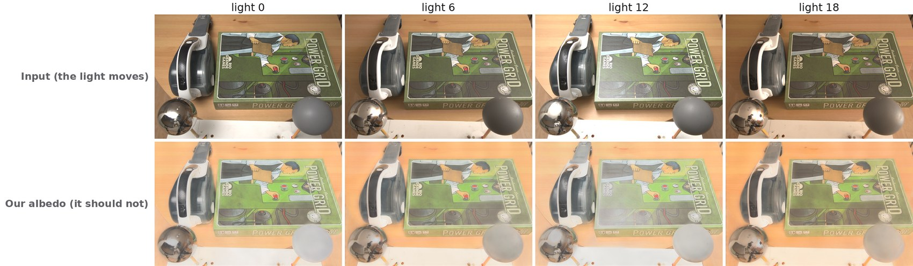
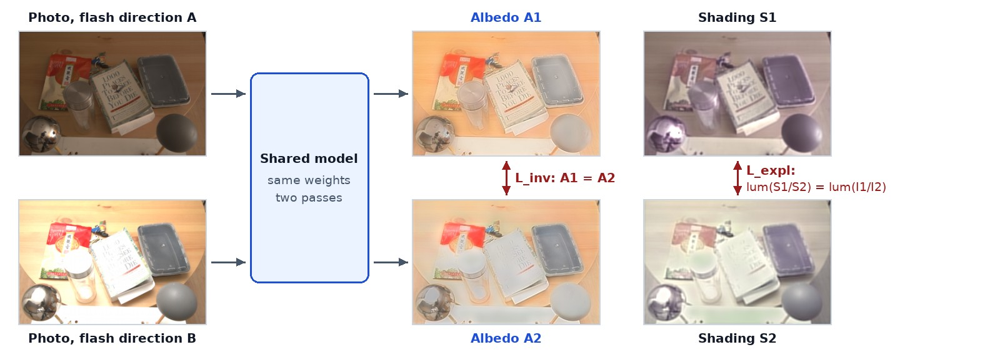
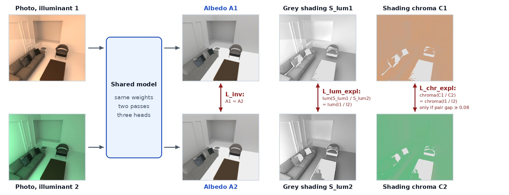

<div align="center">

# Cross-Illumination Albedo Invariance (CIAI)<br>Lightness-Stable Intrinsic Decomposition from Real Multi-Illumination Photographs

**Train on two photographs of one scene under different lighting, and the albedo stops changing with the light.**

**Minh Khang Tran** &middot; MSc thesis project, 2026

[](documents/thesis/Main.pdf)
[](https://tmkhang1999.github.io/CIAI/)
[](https://www.python.org)
[](https://pytorch.org)



</div>

**Figure 1.** One scene photographed with the flash bounced in four directions (top), and the albedo our model predicts from each photograph separately (bottom). The surfaces do not change, so the albedo should not either.

## Overview

Intrinsic image decomposition (IID) splits a photograph into the albedo of each surface and the shading that falls on it. However, a single image cannot tell a dark surface from a dimly lit one, so part of the lighting leaks into the albedo. As a result, the same wall can come out lighter or darker depending on how the room was lit.

The purpose of this project is to reduce this leakage with a training strategy, **Cross-Illumination Albedo Invariance (CIAI)**. Two photographs of one scene under different lighting go through the same network, and their predicted albedos must agree. The pairs are used only in training, so inference is still one image and one forward pass.

In a matched ablation, CIAI lowers the lightness variation of a material across lighting by **28% and 39%**. In addition, it lowers the albedo error by 7-14% on ARAP renderings that keep their original coloured light, although ARAP is never used in training. However, it improves colour much less (hue drift -4 to -6%), because the explanation loss uses luminance only.

**Contributions**
1. A paired training strategy on real photographs: MID pairs with pseudo-ground-truth albedo, added as a second training stage.
2. A matched ablation showing the effect on lightness stability and on albedo accuracy.
3. An evaluation that reports every stability score next to an accuracy score, because a grey, constant albedo is perfectly stable.

## Method

<div align="center">

</div>

**Figure 2.** CIAI is used in training only. Two flash directions of one scene share one model.

The model is a frozen DINOv2-L encoder with a DPT decoder, an albedo head and a three-channel shading head (18.5M trainable parameters). A residual R = (I - A * S)<sub>+</sub> absorbs highlights. Training has two stages:

- **Stage A.** Supervised training on Hypersim and InteriorVerse.
- **Stage B (CIAI).** Training continues on raw pairs from the Multi-Illumination Dataset (MID), where every scene is photographed 25 times with a flash bounced in a different direction, with the pseudo-ground-truth albedo from [MIDIntrinsics](https://github.com/compphoto/MIDIntrinsics). Two losses tie the pair:
  - `L_inv`: masked L1 between the two albedos.
  - `L_expl`: the log luminance ratio of the two shadings must equal that of the two images, which rules out a flat albedo.

The frozen encoder tends to wash out the albedo colour, so the model also has a **colour path**: an RGB skip into the albedo head and a chroma loss on albedo. This is a design choice of the model, not part of CIAI, and the skip can pass the light colour of the input into the albedo as a colour cast.

## Results

All numbers use the 30 held-out MID scenes with raw input. The ablation starts from one shared checkpoint with the same data and steps.

| CIAI | Colour path | C<sub>mat</sub> &darr; | Cast<sub>rel</sub> &darr; | MAW &Delta;E &darr; | ARAP raw LMSE &darr; |
|:---:|:---:|:---:|:---:|:---:|:---:|
| off | off | 0.250 | 0.477 | 4.43 | 0.0463 |
| on  | off | 0.180 | 0.447 | 4.63 | 0.0397 |
| off | on  | 0.259 | 0.444 | **4.12** | 0.0426 |
| on  | on  | **0.157** | **0.425** | 4.16 | **0.0396** |

**Table 1.** Matched ablation. C<sub>mat</sub> is the lightness variation of a material across lighting, Cast<sub>rel</sub> the relative hue drift. The last row is our model.

| Method | C<sub>mat</sub> &darr; | Cast<sub>rel</sub> &darr; | Chroma err &darr; | MAW &Delta;E &darr; |
|:---|:---:|:---:|:---:|:---:|
| **Ours** | 0.157 | 0.425 | 0.129 | 4.16 |
| CD-IID | 0.190 | **0.306** | **0.090** | **3.37**\* |
| RGB&rarr;X | **0.128** | 0.338 | 0.203 | - |
| CRefNet | 0.151 | 0.355 | 0.201 | 3.97 |
| Marigold-App | 0.193 | 0.355 | 0.195 | 3.78 |
| Marigold-Light | 0.546 | 0.392 | 0.154 | 4.21 |
| Ordinal Shading | 0.252 | 0.549 | 0.148 | 6.88 |

**Table 2.** Comparison with other methods. \* Value reported in the CD-IID paper.

1. **CIAI improves lightness stability.** C<sub>mat</sub> drops by 28% and 39% in the two matched pairs. Our model is more stable than CD-IID, both Marigold variants and Ordinal Shading, level with CRefNet, and behind RGB&rarr;X.
2. **CIAI improves accuracy where the input carries its lighting.** On raw ARAP, albedo LMSE drops by 14% and 7%.
3. **CIAI does not improve measured colour.** MAW &Delta;E does not improve, and CD-IID is better on all colour measures.

## Quick start

```bash
git clone https://github.com/tmkhang1999/CIAI.git && cd CIAI
conda create -n ciai python=3.10 -y && conda activate ciai
pip install -r requirements.txt
python tests/smoke_test.py          # one training step per config on random data, CPU, about 1 min

# Decompose one photograph (--device also accepts mps or cpu)
python tests/infer/infer_wild.py --image your_photo.jpg \
    --checkpoint checkpoints/v17_44/checkpoint_iter_40000.pth --device cuda --max_size 1280
```

## Training

Place the datasets next to this repository: `datasets/hypersim/`, `datasets/MIDIntrinsics/{train,test}/` and `datasets/IndoorInverseRendering/interiorverse/` ([Hypersim](https://github.com/apple/ml-hypersim), [MIDIntrinsics](https://github.com/compphoto/MIDIntrinsics), [InteriorVerse](https://interiorverse.github.io/)).

```bash
bash scripts/train.sh --version 17_60 --cuda 0                    # Stage A, stop at 19k
bash scripts/train.sh --version 17_44 --cuda 0 --skip-optimizer   # Stage B (CIAI) from the 19k checkpoint
```

`v17_41` to `v17_44` are the four ablation rows, and `v17_44` is the reported model. Training needs a GPU with at least 12 GB, because each step runs two forward passes. The CIAI losses are in `src/losses/ciai.py` and take plain tensors, so any model that outputs an albedo and a shading can use them.

## Evaluation

```bash
CKPT=checkpoints/v17_44/checkpoint_iter_40000.pth
python tests/eval/eval_mid_constancy.py --ckpts $CKPT --mid-root ../datasets/MIDIntrinsics --split test --save-json
python tests/eval/eval_maw.py --ckpts $CKPT --save-json
python tests/eval/eval_arap.py --checkpoint $CKPT --constancy
```

## Limitations

- **Colour is not learned.** The explanation loss uses luminance only, and the flash in MID is white, so the light colour changes only slightly between frames (median chromaticity gap 0.030). Therefore, hue drift still grows with the light colour, as in a grey-shading model.
- **ARAP numbers are provisional.** ARAP stores its ground-truth albedo in three encodings, and the current mask does not handle all of them. They will be regenerated with `tests/eval/arap_preprocess.py`.
- **Figures and weights.** Some qualitative figures were made with a later checkpoint of the same model, and pretrained weights are not in this repository (about 1.4 GB each). Please open an issue if you would like access.

## Roadmap

The next stage targets colour. It is planned and not trained yet.

<div align="center">

</div>

**Figure 3.** Planned pipeline. The output panels are ground-truth targets from a rendered 3D-Front scene (S = I / A), not predictions.

1. **Cross-architecture test.** Train with and without CIAI on a CNN, a fine-tuned ViT and a single-step diffusion model, with the same data and three seeds.
2. **Model.** Split the shading into a grey part and a chroma part, I = A * (S<sub>lum</sub> * C) + R (`src/models/v21_trifactor.py`).
3. **Loss.** Add a chroma explanation loss on C, used only on pairs whose light colour really changes (`src/losses/v21_loss.py`).
4. **Data.** Rendered coloured-light pairs from 3D-FRONT with exact albedo (`scripts/render_3dfront_dataset_v2.py`, needs Blender 4.2), and real coloured-light pairs such as LSMI.

## Citation

```bibtex
@misc{tran2026ciai,
  title  = {Cross-Illumination Albedo Invariance: Lightness-Stable Intrinsic
            Decomposition from Real Multi-Illumination Photographs},
  author = {Tran, Minh Khang},
  year   = {2026},
  note   = {Project report, revised from the author's MSc thesis (Erasmus Mundus
            Joint Master in Computational Colour and Spectral Imaging, NTNU)},
  url    = {https://github.com/tmkhang1999/CIAI}
}
```

## Acknowledgements

This work started as an MSc thesis supervised by Dr. Luis Gomez Robledo and Prof. Seyed Ali Amirshahi (COSI),
with Dr. Sezer Karaoglu and Prof. Theo Gevers at the host institution. It builds on
[DINOv2](https://github.com/facebookresearch/dinov2) and [DPT](https://github.com/isl-org/DPT), and uses
[MID](https://projects.csail.mit.edu/illumination/), [MIDIntrinsics](https://github.com/compphoto/MIDIntrinsics),
[Hypersim](https://github.com/apple/ml-hypersim), [InteriorVerse](https://interiorverse.github.io/),
[MAW](https://measuredalbedo.github.io/), [IIW](http://opensurfaces.cs.cornell.edu/intrinsic/) and ARAP.
Baselines: [Marigold-IID](https://github.com/prs-eth/Marigold),
[Ordinal Shading and CD-IID](https://github.com/compphoto/Intrinsic), RGB&rarr;X and CRefNet.
