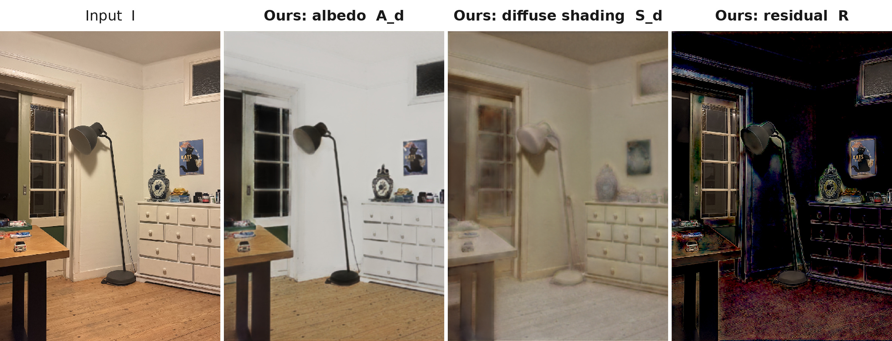

<div align="center">

# Cross-Illumination Albedo Invariance (CIAI)<br>Lightness-Stable Intrinsic Decomposition from Real Multi-Illumination Photographs

**Minh Khang Tran**

[](documents/thesis/Main.pdf)
[](https://tmkhang1999.github.io/CARI/)
[](https://www.python.org)
[](https://pytorch.org)


</div>

<p align="center"><em>The light moves; the material does not. One scene with the flash bounced in four directions (top),
and the albedo recovered from each photograph independently (bottom).</em></p>

---

CIAI is a training strategy for intrinsic image decomposition (IID). Two photographs of the same
scene under different illumination go through the same network. Their predicted albedos must agree,
and the shading must explain the brightness change between them. The pairing exists only at
training time: inference is one image and one forward pass.

The idea borrows from Siamese/contrastive representation learning (two views of one thing must map
to the same representation) and from multi-view consistency in 3D reconstruction (one surface
observed several times must be assigned one property). Unlike contrastive learning there are no
negative pairs: only positive pairs with a dense, physically motivated agreement target.

No dataset offers real photographs under several illuminations *and* dense ground-truth albedo. We
use the Multi-Illumination Dataset (MID), where every scene is captured 25 times with a flash bounced
in a different direction, together with the pseudo-ground-truth albedo that
[MIDIntrinsics](https://github.com/compphoto/MIDIntrinsics) derives for all 25 frames.

**What it does.** In matched ablations CIAI lowers the variation of a material's recovered
*lightness* across lighting (C<sub>mat</sub>) by 28% and 39%, and lowers the dense albedo error on
ARAP renderings fed with their original coloured lighting by 7&ndash;14%, a benchmark it never trained
on. The model trains 18.5M parameters on top of a frozen DINOv2-L encoder.

**What it does not do (yet).** It does not make the albedo stable in *colour*. MID's flashes are
white, so the illuminant colour barely changes between frames (median chromaticity gap 0.030), and
the explanation loss is defined on luminance. Under CIAI hue drift improves by only 4&ndash;6%, and the
model's hue drift still grows with illuminant colour as much as a grey-shading method's. CD-IID,
which predicts the shading colour in a dedicated stage, leads both colour measurements. The colour
axis is the next stage of this project; see [Roadmap](#roadmap).

Full write-up: **[project page](https://tmkhang1999.github.io/CARI/)** &middot;
**[report PDF](documents/thesis/Main.pdf)**. The repository keeps its earlier name (`CARI`).

---

## Findings

| | Result | Evidence |
|:---|:---|:---|
| 1 | Paired cross-illumination training improves lightness stability | C<sub>mat</sub> 0.250 &rarr; 0.180 and 0.259 &rarr; 0.157 in the two matched ablation pairs |
| 2 | It also improves albedo accuracy where the input carries its lighting | Raw-input ARAP LMSE &minus;14% and &minus;7%, RMSE &minus;14% and &minus;8% (provisional ARAP mask) |
| 3 | It barely improves colour stability | Cast<sub>rel</sub> &minus;6% and &minus;4%; hue drift tracks illuminant colour like a grey-shading model (1.43 vs CRefNet 1.42, CD-IID 1.02) |
| 4 | MID varies light direction and intensity, not colour | Median illuminant chromaticity gap 0.030; 86% of frame pairs below 0.08 |
| 5 | The base model washes out colour; CIAI does not cause it | Without the colour path the chroma spread ratio is 0.51 with CIAI off and 0.48 with it on; the colour path restores 0.93&ndash;1.00 |
| 6 | A chroma explanation loss on 3-channel shading is not enough | Drift &minus;3.5% but model chroma &minus;2.9%; with synthetic coloured pairs it desaturates (spread ratio &minus;0.10) |
| 7 | Synthetic coloured pairs are learned but do not transfer | 3D-Front validation invariance gap 0.0013, real hue drift unchanged |

Against other methods on MID, the model is more lightness-stable than CD-IID, both Marigold
variants and Ordinal Shading, level with CRefNet and behind RGB&rarr;X. Rows 6 and 7 are single- or
two-seed studies and are reported as nulls, not trends.

---

## Quick start

```bash
git clone https://github.com/tmkhang1999/CARI.git
cd CARI
conda create -n ciai python=3.10 -y && conda activate ciai
pip install -r requirements.txt
python tests/smoke_test.py          # one training step per config on random data, CPU, ~1 min
```

Decompose a photograph into albedo, shading and residual (`--device` accepts `cuda`, `mps` or `cpu`):

```bash
python tests/infer/infer_wild.py \
    --image path/to/your_photo.jpg \
    --checkpoint checkpoints/v17_44/checkpoint_iter_40000.pth \
    --device cuda --max_size 1280
```

<div align="center">

<p><em>Input &middot; diffuse albedo <code>A_d</code> &middot; diffuse shading <code>S_d</code> &middot; analytic residual <code>R</code>.</em></p>
</div>

Training wants a GPU with &ge; 12 GB (two forward passes per step); inference runs in 6 GB.

> [!NOTE]
> Pretrained weights are not distributed in this repository (each checkpoint is ~1.4 GB, of which
> ~94% is the frozen DINOv2 encoder). Please open an issue if you would like access.

---

## Code

```
src/
├── losses/
│   ├── ciai.py          # the training strategy: albedo invariance, luminance and chroma explanation
│   ├── v17_loss.py      # V17 single-image losses
│   └── v21_loss.py      # V21 losses (next model)
├── models/
│   ├── v17.py           # reported model: frozen DINOv2-L + DPT, albedo + 3-channel shading
│   └── v21_trifactor.py # next model: I = A * (S_lum * C) + R
├── data/                # Hypersim, MID (pairs + measured pair gap), InteriorVerse, 3D-Front v1/v2
├── configs/             # base.yaml, v17.yaml and one file per experiment, v21.yaml
├── metrics.py           # albedo/shading metrics shared by validation and ARAP
├── train_v17.py
└── train_v21.py
tests/
├── smoke_test.py        # data-free check of every config
├── eval/                # benchmark evaluators, baseline adapters, study readouts
├── infer/infer_wild.py  # single-image inference and the shared model loader
└── viz/                 # figure builders for the report and project page
scripts/                 # train.sh, resilient launcher, 3D-Front renderers, benchmark runners
documents/thesis/        # report sources and PDF; FIGURE_PROVENANCE.md maps figures to scripts
documents/results/       # result files the report cites
```

`src/losses/ciai.py` takes plain tensors (two albedos, two linear shadings, two images, a mask), so
any model that outputs an albedo and a shading can be trained with CIAI.

---

## Data

| Corpus | Role | Source |
|:---|:---|:---|
| **Hypersim** | Supervised albedo and shading (synthetic) | [apple/ml-hypersim](https://github.com/apple/ml-hypersim) |
| **MID + MIDIntrinsics** | Real pairs for CIAI and a pseudo-GT albedo shared by all 25 frames | [MID](https://projects.csail.mit.edu/illumination/), [MIDIntrinsics](https://github.com/compphoto/MIDIntrinsics) |
| **InteriorVerse** | Extra albedo supervision | [InteriorVerse](https://interiorverse.github.io/) |
| **3D-Front-IID** | Rendered here: coloured-light pairs with exact factors (colour study, V21) | built from [3D-FRONT](https://tianchi.aliyun.com/dataset/65347) |

```
datasets/              # next to this repository
├── hypersim/
├── MIDIntrinsics/{train,test}/
├── IndoorInverseRendering/interiorverse/...
├── front3d_iid/       # v1
└── front3d_iid_v2/    # v2
```

MID pairs are loaded without per-frame white balance (`mid_raw_color_pair: true`). Probe white
balance rescales R and B to neutralise each frame's light colour and leaves intensity untouched, so
the raw pair keeps only the small bounce-colour change between frames. Each MID pair also carries
`pair_gap`, its illuminant chromaticity gap measured on the grey probes.

<details>
<summary><b>Rendering 3D-Front-IID</b></summary>

<br>

Each camera is rendered under 2&ndash;3 lighting variants with an exact, pixel-aligned albedo pass.
Version 1 (960 rooms, 5,056 pairs) has a median effective illuminant gap of 0.153, but its weakest
decile (0.069) is above MID's median, so it never shows a subtle colour change. Version 2 adds a
neutral anchor rig and spans 0.008 to 0.35; its pilot fails only the hard-shadow quality gate.

```bash
python scripts/render_3dfront_dataset_v2.py --help     # requires Blender 4.2
python scripts/validate_3dfront_v2.py --help
```
</details>

---

## Training

```bash
bash scripts/train.sh --version 17_60 --cuda 0                    # Stage A, stop at 19k
bash scripts/train.sh --version 17_44 --cuda 0 --skip-optimizer   # CIAI from the 19k checkpoint
bash scripts/train.sh --version 17_44 --cuda 0 --auto-resume      # resume
```

| Config | Purpose |
|:---|:---|
| `v17_60` | Stage A (Hypersim, then + InteriorVerse); its 19k checkpoint is the shared fork |
| `v17_41` &hellip; `v17_44` | Ablation: CIAI &times; colour path. **`v17_44` is the reported model** |
| `v17_61` &hellip; `v17_64` | Study 1: chroma explanation loss (seeds via `--seed`) |
| `v17_20`, `v17_29` | Colour study: continue v17_44 without / with 3D-Front pairs |
| `v21` | Next model: luminance + chroma shading, gap-gated chroma explanation |

`scripts/train_resilient.sh` restarts an interrupted run from its own checkpoint, useful on
preemptible GPUs.

---

## Evaluation

Every stability number is reported next to an accuracy number, because a grey, constant albedo is
perfectly stable.

| Benchmark | Measures | Input | Compared against |
|:---|:---|:---|:---|
| MID (30 held-out scenes) | C<sub>mat</sub> lightness drift, Cast<sub>rel</sub> hue drift, chroma error vs pseudo-GT | raw frames | all methods run locally (MID is training data for us and CD-IID) |
| MAW | &Delta;E and intensity SI-MSE vs measured albedo | real photographs | CD-IID Table 1 |
| IIW | WHDR | real photographs | Ordinal Shading Table 2 |
| ARAP | C<sub>arap</sub> on colour-varying groups; LMSE, RMSE, SSIM | raw and white-balanced | Ordinal Shading Table 1 |

```bash
CKPT=checkpoints/v17_44/checkpoint_iter_40000.pth
python tests/eval/eval_mid_constancy.py --ckpts $CKPT --mid-root ../datasets/MIDIntrinsics --split test --save-json
python tests/eval/mid_colour_stratified.py        # hue drift by illuminant-gap tercile
python tests/eval/paired_bootstrap_mid.py         # paired per-scene tests against each baseline
python tests/eval/eval_maw.py --ckpts $CKPT --save-json
python tests/eval/eval_iiw.py --checkpoint $CKPT --dataset_dir tests/testing_data/iiw-dataset/data
python tests/eval/eval_arap.py --checkpoint $CKPT --constancy
```

`scripts/eval_all_models_4benchmarks_full.py` and `scripts/eval_sota_4benchmarks_full.py` run all
four benchmarks for our checkpoints and the baselines (adapters in `tests/eval/*_adapter.py`).

> [!WARNING]
> ARAP stores its ground-truth albedo in three encodings, and `eval_arap.py` masks pixels with a
> fixed absolute threshold that keeps about 1.5% of the frame on 40 scenes and drops 21 images. The
> ARAP numbers in the report are provisional; `tests/eval/arap_preprocess.py` canonicalises the
> encodings and the tables will be regenerated with it.

---

## Roadmap

1. **Show that CIAI is architecture-agnostic.** With and without CIAI, same data and steps, three
   seeds, on a CNN (U-Net), a fine-tuned ViT (DPT on DINOv2) and a single-step fine-tuned diffusion
   model (Marigold-IID). `src/losses/ciai.py` is model-independent for this purpose.
2. **Model: luminance and chroma shading** (`v21_trifactor.py`). The albedo head receives the
   illuminant-corrected image I / (S<sub>lum</sub> &middot; C) instead of the raw RGB skip.
3. **Losses** (`v21_loss.py`). Albedo invariance, luminance explanation, and a chroma explanation
   applied only to pairs whose measured gap reaches `chr_explain_min_gap`; direct supervision of C.
4. **Data.** 3D-Front-IID v2, and real coloured-illuminant pairs (for example LSMI, which photographs
   each scene under several illuminant combinations with per-pixel illuminant chromaticity).
5. **Evaluation.** Hue drift on genuinely colour-varying real data next to MAW; ARAP regenerated.

---

## Citation

```bibtex
@misc{tran2026ciai,
  title  = {Cross-Illumination Albedo Invariance: Lightness-Stable Intrinsic
            Decomposition from Real Multi-Illumination Photographs},
  author = {Tran, Minh Khang},
  year   = {2026},
  note   = {Project report, revised from the author's MSc thesis (Erasmus Mundus
            Joint Master in Computational Colour and Spectral Imaging, NTNU)},
  url    = {https://github.com/tmkhang1999/CARI}
}
```

---

## Acknowledgements

The work started as an MSc thesis supervised by Dr. Luis Gomez Robledo and Prof. Seyed Ali
Amirshahi (COSI), with Dr. Sezer Karaoglu and Prof. Theo Gevers at the host institution.

It builds on [DINOv2](https://github.com/facebookresearch/dinov2) and
[DPT](https://github.com/isl-org/DPT), and is evaluated against
[Marigold-IID](https://github.com/prs-eth/Marigold),
[Ordinal Shading and CD-IID](https://github.com/compphoto/Intrinsic), RGB&rarr;X and CRefNet.
Benchmarks: [IIW](http://opensurfaces.cs.cornell.edu/intrinsic/),
[MID](https://projects.csail.mit.edu/illumination/), [MAW](https://measuredalbedo.github.io/), ARAP.
Training data: [Hypersim](https://github.com/apple/ml-hypersim),
[MIDIntrinsics](https://github.com/compphoto/MIDIntrinsics),
[InteriorVerse](https://interiorverse.github.io/), [3D-FRONT](https://tianchi.aliyun.com/dataset/65347).
